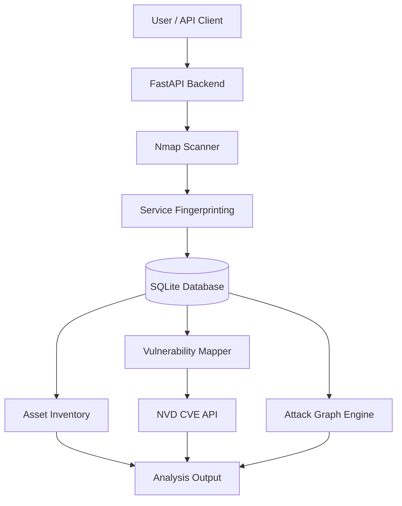

# AttackPath

**Attack Surface Discovery & Attack Path Visualization Platform**

AttackPath is a cybersecurity analysis project designed to discover exposed network services, maintain an inventory of scanned assets, identify potential vulnerabilities, and represent relationships between attackers, hosts, services, and vulnerabilities through an attack graph.

The goal is to transform raw network scan results into a structured view of an environment's attack surface, helping security analysts understand potential exposure and prioritize further investigation.

> **Project status:** Under active development.

## Key Features

- **Network Scanning** — Integrates Nmap service detection to discover hosts and their exposed ports.
- **Asset Inventory** — Stores discovered hosts and services in a local SQLite database.
- **Service Fingerprinting** — Collects available service names, product versions, protocols, and CPE identifiers.
- **Vulnerability Mapping** — Maps available service metadata into preliminary vulnerability findings without assuming that an unidentified service is vulnerable.
- **NVD Integration** — Includes a client for querying the National Vulnerability Database (NVD) using CPE identifiers.
- **Attack Graph Generation** — Represents relationships between an attacker, discovered hosts, and their services as graph nodes and edges.
- **REST API** — Exposes scanning, asset inventory, service information, and vulnerability findings through FastAPI.

## Architecture



## Technology Stack

| Component | Technology |
|---|---|
| Programming language | Python |
| API framework | FastAPI |
| ASGI server | Uvicorn |
| Network discovery | Nmap |
| Database | SQLite |
| Vulnerability intelligence | NVD CVE API |
| Graph modeling | Custom Python attack graph |
| API testing | FastAPI Swagger UI |

## Project Structure

```text
attackpath/
├── backend/
│   ├── api/
│   ├── database/
│   │   ├── __init__.py
│   │   └── database.py
│   ├── risk/
│   │   ├── attack_graph.py
│   │   ├── test_attack_graph.py
│   │   ├── vulnerability_mapper.py
│   │   ├── test_vulnerability_mapper.py
│   │   ├── nvd_client.py
│   │   └── test_nvd_client.py
│   ├── scanner/
│   │   ├── nmap_scanner.py
│   │   └── test_scanner.py
│   └── main.py
├── frontend/
├── .gitignore
└── README.md
```

*The tree reflects the intended/current working layout; files may be added or moved as development continues.*

## Getting Started

### Prerequisites

Install the following before running AttackPath:

- Python 3.10 or later
- Nmap
- pip
- Git

### 1. Clone the Repository

```bash
git clone https://github.com/sreevatsarajesh/attackpath.git
cd AttackPath
```

### 2. Create a Virtual Environment

On macOS or Linux:

```bash
python3 -m venv .venv
source .venv/bin/activate
```

### 3. Install Dependencies

```bash
python3 -m pip install fastapi uvicorn requests
```

Ensure Nmap is installed and accessible:

```bash
nmap --version
```

On macOS with Homebrew, install Nmap using:

```bash
brew install nmap
```

### 4. Start the API

From the project root, run:

```bash
uvicorn backend.main:app --reload
```

The API should be available at:

- **API root:** http://127.0.0.1:8000/
- **Interactive API documentation:** http://127.0.0.1:8000/docs
- **Alternative API documentation:** http://127.0.0.1:8000/redoc

The SQLite database is initialized by the backend when the application starts.

## API Endpoints

| Method | Endpoint | Description |
|---|---|---|
| `GET` | `/` | Check whether the API is running |
| `POST` | `/scan` | Scan a specified target and store the results |
| `GET` | `/assets` | Retrieve discovered assets |
| `GET` | `/assets/{asset_id}/services` | Retrieve services associated with an asset |
| `GET` | `/assets/{asset_id}/vulnerabilities` | Retrieve preliminary vulnerability findings |

You can explore and execute these endpoints through the Swagger interface at `/docs`.

### Example: Scan a Local Target

Use the Swagger interface or send a request with `curl`:

```bash
curl -X POST "http://127.0.0.1:8000/scan" \
  -H "Content-Type: application/json" \
  -d '{"target": "127.0.0.1"}'
```

This example assumes the `/scan` endpoint accepts a JSON body with a `target` field.

### Example: Retrieve Discovered Assets

```bash
curl "http://127.0.0.1:8000/assets"
```

### Example: Retrieve Services

Replace `1` with an actual asset ID returned by the API.

```bash
curl "http://127.0.0.1:8000/assets/1/services"
```

## Attack Graph Model

AttackPath uses a graph-based model to represent relationships between discovered entities.

### Node types

- **Attacker** — Represents the starting point of the modeled attack path.
- **Host** — Represents a discovered network host.
- **Service** — Represents a service associated with a host.
- **Vulnerability** — A planned graph entity for incorporating verified vulnerability findings.

### Edge relationships

- `CAN_REACH` — Connects the modeled attacker to a host.
- `RUNS` — Connects a host to a service running on it.
- Additional relationships can be introduced as vulnerability analysis and attack-path modeling evolve.

The current graph foundation models discovered infrastructure and its relationships. It should not be interpreted as proof that a host is exploitable or that a complete attack path has been validated.

## Vulnerability Analysis

AttackPath uses service metadata to support vulnerability investigation.

The intended workflow is:

1. Discover a host and its services using Nmap.
2. Collect available product, version, and CPE information.
3. Query the NVD CVE API when a usable CPE identifier is available.
4. Extract relevant vulnerability metadata.
5. Validate whether each result actually applies to the detected product and version.
6. Incorporate verified findings into the attack graph and risk analysis.

**Important:** An open port or a service name alone does not establish that a vulnerability exists. Missing CPE, product, or version information must be treated as an identification limitation rather than evidence of a vulnerability.

NVD reference: https://nvd.nist.gov/developers/vulnerabilities

## Database Design

The SQLite database currently organizes scan information using the following tables:

| Table | Purpose |
|---|---|
| `scans` | Stores scan records and timestamps |
| `hosts` | Stores discovered hosts associated with scans |
| `ports` | Stores port, protocol, state, service, product, version, and CPE data |
| `vulnerabilities` | Provides a schema for storing vulnerability findings |

This design provides a persistent foundation for asset tracking, vulnerability analysis, and attack graph generation.

## Testing

Run the existing test modules from the project root:

```bash
python3 -m backend.scanner.test_scanner
python3 -m backend.risk.test_attack_graph
python3 -m backend.risk.test_vulnerability_mapper
python3 -m backend.risk.test_nvd_client
```

The NVD client test requires network access. External API availability and rate limits may affect its result.

Run only tests that exist in your current project structure.

## Roadmap

- [x] Nmap-based service discovery
- [x] SQLite persistence for scan results
- [x] Asset and service API endpoints
- [x] Initial attack graph generation
- [x] Preliminary vulnerability mapping
- [ ] Normalize NVD responses into structured CVE findings
- [ ] Validate vulnerability applicability against product versions
- [ ] Persist verified CVE findings in the database
- [ ] Add vulnerability nodes and relationships to the attack graph
- [ ] Develop a risk scoring and prioritization system
- [ ] Build an interactive attack graph visualization in the frontend
- [ ] Add automated tests and structured logging
- [ ] Add scan history and asset comparison

## Security and Responsible Use

AttackPath is intended for defensive security analysis, authorized asset discovery, and cybersecurity education.

- Scan only systems you own or have explicit permission to assess.
- Begin testing with localhost or a controlled lab environment.
- Do not interpret discovered services as proof of compromise or exploitability.
- Verify vulnerability findings before using them for security decisions.
- Protect scan results because they may reveal sensitive information about a network.

## Contributing

Contributions, bug reports, and suggestions are welcome. For substantial changes, consider opening an issue first to discuss the proposed implementation.

## License

No license has been specified yet. Until a license is added to the repository, reuse and redistribution are not automatically permitted. Consider adding an appropriate open-source license if you intend to accept external contributions.

---

**AttackPath** — Discover the attack surface. Map the relationships. Prioritize the risks.
